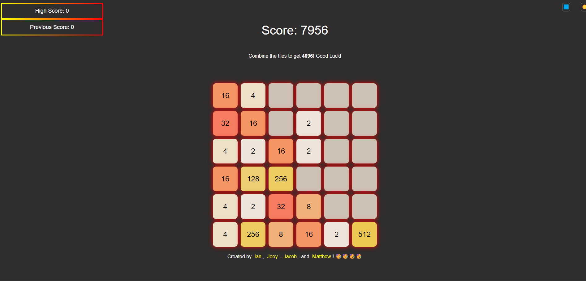

<h1 align="center">Welcome to the Puzzle Game Application</h1><br> 
<h1 align="center">4096</h1>
<br>

 ### Introduction<br>
<font color="orange"> What was our motivation?</font><br>
 The purpose of building the application is to implement what we learned as a student of Full Stack Application Developer<br>
 <font color="orange">Why did we build this project?</font><br>
 We built the 4096 game because it's an interesting interactive user friendly puzzle game that gave us a scope for using html, css and javascript.<br>
 <font color="orange">What problem does it solve?</font><br>
 The application handles the events of dragging and dropping of the tiles at user desired locations using arrow keys. It does the work of generating random numbers, ranadom tiles, does the calculation of merged tiles, displays current score, the highest achieved score for a player.<br>

<font color="orange">What did we learn?</font><br>
We learned how to use different types of Event Handling involving dragging and dropping, moving tiles with arrows. Creating random tiles with random colors, and assigning random values on each tile after every movement, was a good learning activity. We learned  Math functions of calculation. We learnt how to store the tile values and user's score in the browser's local storage and again displaying them with display functions.

<font color="orange">What makes our project stand out?</font><br>
Our project stands out because of its cool appearance and functionality. It provides users a scope to face challenges and yet offers hours of relaxation and mental workout.<br>
<font color="orange">Some of the challenges we faced during the application development</font><br>
- Applying Bootstrap CSS framework
- Creating a JS based game system that also utilizes CSS theming.
- Incorporating modals that trigger when the game is won or lost


<font color="orange">Features we plan to implement in the future</font><br>
Tile animation

### Description


 **4096** is a very captivating puzzle game demanding players to merge tiles with the same number. The purpose is to build a large number with the target to gain **4096**. With the movement of arrow keys players have to tactically merge same numbers in a 8x8 grid to achieve the desired high number and making space for new tiles. **4096** is a tile merging game that offers users hours of relaxation and mental workout.


### Objective

The purposes of the game is to merge the tiles to form the number  4096. Initially the game begins with a few tiles on the the grid. The players can move the tiles with the same value up, down, right and left with the arrow keys to merge the tiles and form a new tile with doubled value. For example, one can merge two tiles having the value 5 to  create a new tile with the value 10. When a player successfully generates 4096 or when there are no valid moves possible, the game ends.


### Installation
 No installation required.

###  Features
8x8 Grid: The grid is larger compared to traditional 4x4 games. Therefore, it provides a distinctive challenge and demands more strategic planning.<br>
Responsive Controls: The controls are smooth and responsive. So, it provides an enjoyable experience of game.<br>
Local Storage: Players' high scores and previous game status are saved locally. This allows the players to pick up where they left off or start a new game.
 
### Usage


 Use your arrow keys to move the tiles. Up Arrow will move the tiles up, Down Arrow will move them down, Left Arrow will move the tiles left and Right Arrow key will shift the tiles to the right.


### Mechanism


__Starting the Game:__ The game starts with two tiles placed randomly on the  8x8 grid. These tiles can have a value of 2,4,8 or 16.<br> <br>
__Moving the Tiles:__ All the tiles on the grid will slide in the direction of the arrow key movement until they hit the edge of the grid or another tile.<br><br>
__Merging Tiles:__ If two tiles of same value touch each other while moving, they will merge into one tile with doubled value. As you play with the up, down, right and left keys the tiles will change positions and color.  As you play the tiles will display random numbers. You can merge the tiles with the same number into one when they touch. For example, if a tile with number 8 touches another tile with number 8 on it, the two 8s will merge to 16 and so on. There are two score boards for **Current Score** and **Highest Score**. Current score displays your current total while the Highest Score shows the highest total you achieved in your total number of games.<br><br>
**Adding New Tiles:** A new tile appears on the grid at a random empty spot after each move. It can have a value of 2,4,8, or 16, more common to have with value 2 and 4.<br><br> 
**Game Over:** When there are no more valid moves available, having no empty spaces and when there are no two neighboring tiles with the same value, the game ends.<br><br>
**Winning the Game:** A player wins when he has created a tile with the **4096** on it. However,if desired, he can continue to play to achieve higher scores.<br><br>
**Strategies:**<br> 
**Planning before a move:** One has to plan ahead considering the result of each move and how new tiles will alter the placement of the tiles on the grid. Avoiding random movement is a good strategy, else it can quickly fill the grid and your options may become limited.<br>
**Focus on Corners:** Players must try to keep the tiles with highest values in a corner, so that it will be easy to control the board and merge other tiles towards that corner.<br>
**Create Space:** You must try to move away tiles with lower values to make room for new tiles with higher values.<br>
**Chain Reaction:** You should look for the opportunity to create a chain reaction where one merge leads to another. This will help in making more space and getting higher values in less moves.<br>
**Scoring**<br>
**Score:** Players earn points equal to the value on the new tile they merge each time. For example, if you merge two tiles with 32 on it, you will earn 64.<br>
**High Score:** The game application will keep track of the highest score you gained. You can compete with your friends by collecting highest score.<br><br>

### Technologies Used:


*  html<br>
*  Java<br>
*  CSS<br>
*  CSS Framework: Bootstrap


### Credits:
Collaborators with GitHub Links:

  * Ian Stocker : <br> https://github.com/IanStocker02
  * Elliot Stocker: <br> https://github.com/jelliots2
  * Joey Vedder: <br> https://github.com/JoeyVedder
  * Matthew Mendez: <br> https://github.com/Plutarch1971

### Resources Used:
-Bootstrap CSS Framework
-jQuery (for Bootstrap)
-jsDelivr (for Bootstrap)
-Popper (for Bootsrap)


### License
MIT License<br>

Copyright <2024> 

Permission is hereby granted, free of charge, to any person obtaining a copy of this software and associated documentation files (the “Software”), to deal in the Software without restriction, including without limitation the rights to use, copy, modify, merge, publish, distribute, sublicense, and/or sell copies of the Software, and to permit persons to whom the Software is furnished to do so, subject to the following conditions:

The above copyright notice and this permission notice shall be included in all copies or substantial portions of the Software.

THE SOFTWARE IS PROVIDED “AS IS”, WITHOUT WARRANTY OF ANY KIND, EXPRESS OR IMPLIED, INCLUDING BUT NOT LIMITED TO THE WARRANTIES OF MERCHANTABILITY, FITNESS FOR A PARTICULAR PURPOSE AND NONINFRINGEMENT. IN NO EVENT SHALL THE AUTHORS OR COPYRIGHT HOLDERS BE LIABLE FOR ANY CLAIM, DAMAGES OR OTHER LIABILITY, WHETHER IN AN ACTION OF CONTRACT, TORT OR OTHERWISE, ARISING FROM, OUT OF OR IN CONNECTION WITH THE SOFTWARE OR THE USE OR OTHER DEALINGS IN THE SOFTWARE.

### Conclusion
"4096" is a test of foresight, planning, and  strategy. It is not only a game, but provides endless hours of entertainment where players tries hard to reach the ultimate goal of creating a 4096 tile. "4096" offers a rewarding and challenging experience for all, whether one is a casual player looking for a quick puzzle fix or a dedicated gamer who aims for high scores.<br>

### Additional Instructions
This is a web-based application that runs within your browser. To play the game, click the "OK" button on the pop-up, and then use your arrow keys or WASD keys to play. If you're on mobile, you can use your touch screen to play.<br>

    

  


# How to Contribute

 Contributor Covenant Code of Conduct

## Our Pledge

We as members, contributors, and leaders pledge to make participation in our
community a harassment-free experience for everyone, regardless of age, body
size, visible or invisible disability, ethnicity, sex characteristics, gender
identity and expression, level of experience, education, socio-economic status,
nationality, personal appearance, race, caste, color, religion, or sexual
identity and orientation.

We pledge to act and interact in ways that contribute to an open, welcoming,
diverse, inclusive, and healthy community.

## Our Standards

Examples of behavior that contributes to a positive environment for our
community include:

* Demonstrating empathy and kindness toward other people
* Being respectful of differing opinions, viewpoints, and experiences
* Giving and gracefully accepting constructive feedback
* Accepting responsibility and apologizing to those affected by our mistakes,
  and learning from the experience
* Focusing on what is best not just for us as individuals, but for the overall
  community

Examples of unacceptable behavior include:

* The use of sexualized language or imagery, and sexual attention or advances of
  any kind
* Trolling, insulting or derogatory comments, and personal or political attacks
* Public or private harassment
* Publishing others' private information, such as a physical or email address,
  without their explicit permission
* Other conduct which could reasonably be considered inappropriate in a
  professional setting

## Enforcement Responsibilities

Community leaders are responsible for clarifying and enforcing our standards of
acceptable behavior and will take appropriate and fair corrective action in
response to any behavior that they deem inappropriate, threatening, offensive,
or harmful.

Community leaders have the right and responsibility to remove, edit, or reject
comments, commits, code, wiki edits, issues, and other contributions that are
not aligned to this Code of Conduct, and will communicate reasons for moderation
decisions when appropriate.

## Scope

This Code of Conduct applies within all community spaces, and also applies when
an individual is officially representing the community in public spaces.
Examples of representing our community include using an official email address,
posting via an official social media account, or acting as an appointed
representative at an online or offline event.

## Enforcement

Instances of abusive, harassing, or otherwise unacceptable behavior may be
reported to the community leaders responsible for enforcement at
[INSERT CONTACT METHOD].
All complaints will be reviewed and investigated promptly and fairly.

All community leaders are obligated to respect the privacy and security of the
reporter of any incident.

## Enforcement Guidelines

Community leaders will follow these Community Impact Guidelines in determining
the consequences for any action they deem in violation of this Code of Conduct:

### 1. Correction

**Community Impact**: Use of inappropriate language or other behavior deemed
unprofessional or unwelcome in the community.

**Consequence**: A private, written warning from community leaders, providing
clarity around the nature of the violation and an explanation of why the
behavior was inappropriate. A public apology may be requested.

### 2. Warning

**Community Impact**: A violation through a single incident or series of
actions.

**Consequence**: A warning with consequences for continued behavior. No
interaction with the people involved, including unsolicited interaction with
those enforcing the Code of Conduct, for a specified period of time. This
includes avoiding interactions in community spaces as well as external channels
like social media. Violating these terms may lead to a temporary or permanent
ban.

### 3. Temporary Ban

**Community Impact**: A serious violation of community standards, including
sustained inappropriate behavior.

**Consequence**: A temporary ban from any sort of interaction or public
communication with the community for a specified period of time. No public or
private interaction with the people involved, including unsolicited interaction
with those enforcing the Code of Conduct, is allowed during this period.
Violating these terms may lead to a permanent ban.

### 4. Permanent Ban

**Community Impact**: Demonstrating a pattern of violation of community
standards, including sustained inappropriate behavior, harassment of an
individual, or aggression toward or disparagement of classes of individuals.

**Consequence**: A permanent ban from any sort of public interaction within the
community.

## Attribution

This Code of Conduct is adapted from the [Contributor Covenant][homepage],
version 2.1, available at
[https://www.contributor-covenant.org/version/2/1/code_of_conduct.html][v2.1].

Community Impact Guidelines were inspired by
[Mozilla's code of conduct enforcement ladder][Mozilla CoC].

For answers to common questions about this code of conduct, see the FAQ at
[https://www.contributor-covenant.org/faq][FAQ]. Translations are available at
[https://www.contributor-covenant.org/translations][translations].

[homepage]: https://www.contributor-covenant.org
[v2.1]: https://www.contributor-covenant.org/version/2/1/code_of_conduct.html
[Mozilla CoC]: https://github.com/mozilla/diversity
[FAQ]: https://www.contributor-covenant.org/faq
[translations]: https://www.contributor-covenant.org/translations
</font><br>
## Tests

Users can test the modals for our website by opening the console and typing "showWinnerModal"
Users can also test the local storage of scoring for our web based game by changing the winning number. 

Example: 
```javascript
function checkForWinner() {

    for (let row of board) {
        if (row.includes<font color="orange">(4096)</font>) {
            if (score > highScore) {
                highScore = score; // Update high score
                saveScores(); // Save high score to local storage
            }
            showWinnerModal(); // Show winner modal
            return true;
        }
    }
    return false;
}
```

By changing the number in the 3rd lines "if" statement from 4096 to 16, a user can win the game much quicker to make sure the game is storing scores locally.